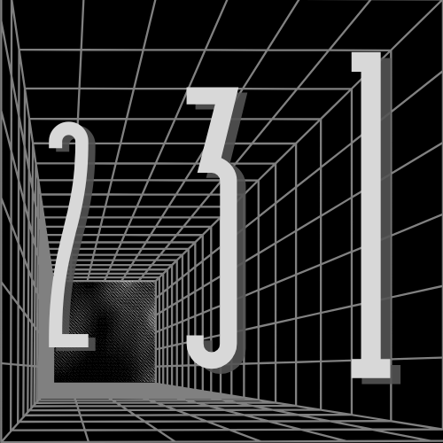

  

### About 231 Labs

We are a research team from the 231 Laboratory at Feng Chia University's College of Information and Electrical Engineering, specializing in cryptography applications and chip security research.
Currently, we are exploring innovative integrations between blockchain technology and physical manufacturing.

### Research Areas
- Parametric Design and Automation
- Digital Assets and Design Rights on Blockchain
- Distributed 3D Printing Manufacturing
- Digital Twin and IoT Integration

---

### 關於 231 Labs

我們是來自逢甲大學資訊電機學院 231 實驗室的研究團隊，專注於密碼學應用與晶片安全領域的研究。
目前致力於探索區塊鏈技術與實體製造的創新整合。

### 研究領域
- 參數式設計與自動化
- 數位資產與設計產權上鏈
- 分布式 3D 列印製造
- 數位孿生與物聯網整合